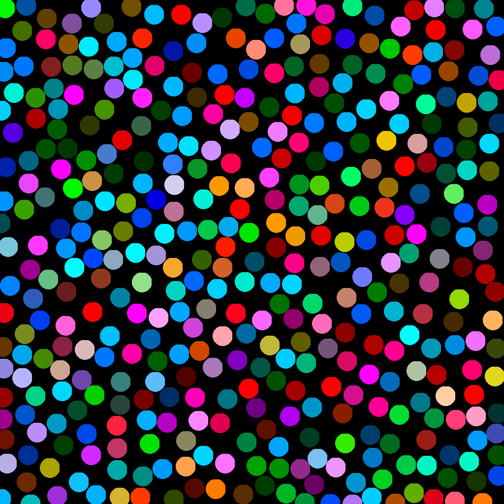

# poisson2d

[![Documentation][di]][dl] [![Crates.io][ri]][rl] [![License: MIT][li]][ll] [![Build Status][ti]][tl]

[di]: https://docs.rs/poisson2d/badge.svg
[dl]: https://docs.rs/poisson2d

[ri]: https://img.shields.io/crates/v/poisson2d.svg
[rl]: https://crates.io/crates/poisson2d/

[li]: https://img.shields.io/badge/License-MIT-blue.svg
[ll]: https://opensource.org/licenses/MIT

[ti]: https://travis-ci.org/benfrankel/poisson2d.svg?branch=master
[tl]: https://travis-ci.org/benfrankel/poisson2d

poisson2d is a fork of [poisson](https://crates.io/crates/poisson), a library for generating N-dimensional [Poisson disk
samplings](http://mollyrocket.com/casey/stream_0014.html). It provides a `mint` API for compatibility with most computer
graphics linear algebra libraries, but can only generate 2D samplings. If you're interested in higher-dimensional
samplings, see [poisson](https://crates.io/crates/poisson).

Specifically, poisson2d can generate a sampling of points in [0, 1)<sup>2</sup> where:

 * Sample points fill the space uniformly.
 * Sample points stay a given minimum distance apart.

This is equivalent to uniformly filling a unit square with non-overlapping
disks of equal radius, where the radius is half the minimum distance:



Due to their blue noise properties, Poisson disk samplings can be used for
object placement in procedural texture/world generation, digital stippling,
sampling in rendering, or (re)meshing.

# Usage

Works with mint 0.5 and rand 0.7.

```rust
use poisson2d::{Builder, Type, algorithm};
use rand::FromEntropy;
use rand::rngs::SmallRng;

fn main() {
    let poisson =
        Builder::with_radius(0.1, Type::Normal)
            .build(SmallRng::from_entropy(), algorithm::Ebeida);
    println!("{:?}", poisson.generate());
}
```
